## Data Analysis - Results
### Summary
We found a significant decrease in 5-hydroxi-methyl-cytosine (5hmC) expression from normal to tumor tissues (P < 0.001), although differences were not apparent between noninvasive and invasive tumors (P = 0.60). We did not found significant associations between 5hmC expression and clinicopathologic features and outcome. Kaplan-Meier curves were not significantly different for patients with low or high 5hmC expression regarding overall mortality and cancer-related mortality. Logistic regression models and Cox's proportional hazard models did not show evidence of a prognostic usefulness of 5hmC in predicting outcome, either in unadjusted or in adjusted models.

***

### Global Options and Dataset
* Defining global options

```r
library(knitr)
opts_chunk$set(warning = FALSE, message = FALSE, fig.height = 7, fig.width = 9)
```

* Loading the dataset, libraries and sources for analysis

```r
data <- read.delim("DatasetBladder.csv")
attach(data)
library(survival)
source("../StandardAnalysis2.R")
source("../SurvivalPlot.R")
```

***

### Description of the Dataset
In this section we will describe the dataset, including patient's clinical features, preoperative and surgical data, pathologic features of the tumor, as well as preoperative and posoperative treatment, and patient's outcome. For this section we will use the full dataset (N = 55). This dataset include all cases that were used for building the tissue microarrays. Data for this section were obtain from medical charts and pathology reports.

#### Patient's clinical features

```r
# Patient's age
descriptive(age)
```

```
##        Values
## Mean     65.4
## SD       11.6
## Median   67.4
## IQR      17.7
## Min      34.8
## Max      88.8
```

```r
# Patient's sex
table.prop(sex)
```

```
##        Count Percentages
## Female    11          20
## Male      44          80
```

```r
# Patient's race
table.prop(race)
```

```
##                  Count Percentages
## African-American     5         9.1
## Caucasian           50        90.9
```

```r
# Concomitant prostate carcinoma
table.prop(pca)
```

```
##     Count Percentages
## No     35        63.6
## Yes    20        36.4
```
#### Preoperative data

```r
# Preoperative specimen
table.prop(pre.specimen)
```

```
##        Count Percentages
## Biopsy    31        56.4
## TURBT     23        41.8
## <NA>       1         1.8
```

```r
# Preoperative pT stage
table.prop(pre.pt)
```

```
##        Count Percentages
## T1        11        20.0
## T2        18        32.7
## T2a        4         7.3
## T2b        3         5.5
## T3         9        16.4
## T4a        1         1.8
## Tis-Ta     8        14.5
## <NA>       1         1.8
```

```r
# Preoperative clinical stage
table.prop(pre.stage)
```

```
##      Count Percentages
## I        7        12.7
## II       8        14.5
## III     28        50.9
## IV       9        16.4
## <NA>     3         5.5
```

```r
# Presence of CIS in preoperative specimen
table.prop(pre.cis)
```

```
##      Count Percentages
## No      26        47.3
## Yes     28        50.9
## <NA>     1         1.8
```
#### Surgical data

```r
# Surgical specimen
table.prop(specimen)
```

```
##                            Count Percentages
## Bladder                       12        21.8
## Other                          2         3.6
## Radical Cystectomy             3         5.5
## Radical Cystoprostatectomy    38        69.1
```

```r
# pT stage at cystectomy
table.prop(pt.cystectomy)
```

```
##        Count Percentages
## T1         5         9.1
## T2         4         7.3
## T2a        3         5.5
## T2b       10        18.2
## T3         2         3.6
## T3a       12        21.8
## T3b        7        12.7
## T4a        6        10.9
## Tis-Ta     6        10.9
```

```r
# Clinical stage at cystectomy
table.prop(stage.cystectomy)
```

```
##      Count Percentages
## I        5         9.1
## II      12        21.8
## III     17        30.9
## IV      15        27.3
## <NA>     6        10.9
```
#### Pathologic data

```r
# Diagnosis according to the pathology report
table.prop(histo.dx)
```

```
##             Count Percentages
## Invasive       49        89.1
## Noninvasive     6        10.9
```

```r
# Diagnosis at the TMA spot
table.prop(spot.dx)
```

```
##             Count Percentages
## Invasive       48        87.3
## Noninvasive     5         9.1
## Normal          2         3.6
```

```r
# Histologic type of the tumor
table.prop(type)
```

```
##           Count Percentages
## Both          1         1.8
## Divergent     3         5.5
## Usual        44        80.0
## <NA>          7        12.7
```

```r
# Presence of CIS
table.prop(cis)
```

```
##     Count Percentages
## No     30        54.5
## Yes    25        45.5
```

```r
# Lymphovascular invasion
table.prop(lvi)
```

```
##     Count Percentages
## No     38        69.1
## Yes    17        30.9
```

```r
# Total number of lymph nodes
descriptive(nodes.total)
```

```
##        Values
## Mean     11.4
## SD        7.6
## Median   12.0
## IQR      11.5
## Min       0.0
## Max      32.0
```

```r
# Presence of lymph nodes metastasis
table.prop(ln.met)
```

```
##     Count Percentages
## No     45        81.8
## Yes    10        18.2
```

```r
# Total number of metastatic lymph nodes
descriptive(nodes.positive)
```

```
##        Values
## Mean      0.4
## SD        1.1
## Median    0.0
## IQR       0.0
## Min       0.0
## Max       5.0
```
#### Treatment

```r
# Preoperative radiotherapy
table.prop(pre.rt)
```

```
##      Count Percentages
## No      52        94.5
## Yes      2         3.6
## <NA>     1         1.8
```

```r
# Preoperative chemotherapy
table.prop(pre.ct)
```

```
##      Count Percentages
## No      50        90.9
## Yes      4         7.3
## <NA>     1         1.8
```

```r
# Intravesical chemotherapy
table.prop(intra.ct)
```

```
##      Count Percentages
## No      26        47.3
## Yes     25        45.5
## <NA>     4         7.3
```

```r
# Intravesical chemotherapy type
table.prop(intra.ct.type)
```

```
##      Count Percentages
## BCG     25        45.5
## <NA>    30        54.5
```

```r
# Posoperative radiotherapy
table.prop(pos.rt)
```

```
##      Count Percentages
## No      49        89.1
## Yes      5         9.1
## <NA>     1         1.8
```

```r
# Posoperative chemotherapy
table.prop(pos.ct)
```

```
##      Count Percentages
## No      31        56.4
## Yes     23        41.8
## <NA>     1         1.8
```

```r
# Posoperative chemotherapy type
table.prop(pos.ct.type)
```

```
##          Count Percentages
## Adjuvant    16        29.1
## Salvage      4         7.3
## <NA>        35        63.6
```
#### Outcome

```r
# Follow-up from cystectomy, in months
descriptive(fu.cystectomy)
```

```
##        Values
## Mean     47.3
## SD       45.0
## Median   33.0
## IQR      51.0
## Min       4.0
## Max     212.0
```

```r
# Follow-up from diagnosis, in months
descriptive(fu.diagnosis)
```

```
##        Values
## Mean     56.0
## SD       52.4
## Median   38.0
## IQR      56.5
## Min       5.0
## Max     240.0
```

```r
# Early complications
table.prop(comp.early)
```

```
##     Count Percentages
## No     33          60
## Yes    22          40
```

```r
# Late complications
table.prop(comp.late)
```

```
##     Count Percentages
## No     29        52.7
## Yes    26        47.3
```

```r
# Metastatic disease after cystectomy
table.prop(metastasis)
```

```
##      Count Percentages
## No      33        60.0
## Yes     18        32.7
## <NA>     4         7.3
```

```r
# Tumor progression, i.e., metastatic disease or patient dying of cancer
table.prop(progression)
```

```
##     Count Percentages
## No     26        47.3
## Yes    29        52.7
```

```r
# Overall mortality, i.e., patient dying of any cause
table.prop(death)
```

```
##     Count Percentages
## No      9        16.4
## Yes    46        83.6
```

```r
# Cancer mortality, i.e., patient dying of cancer (No/Yes)
table.prop(dod)
```

```
##      Count Percentages
## No      14        25.5
## Yes     29        52.7
## <NA>    12        21.8
```
#### Overall 5-hydroxi-methyl-cytosine expression

```r
# Tumor 5hmC median H-score
descriptive(t.5hmc.med)
```

```
##        Values
## Mean     34.1
## SD       34.0
## Median   30.0
## IQR      45.0
## Min       0.0
## Max     130.0
```

```r
# Normal 5hmC median H-score
descriptive(n.5hmc.med)
```

```
##        Values
## Mean    103.9
## SD       68.7
## Median  105.0
## IQR      77.5
## Min       0.0
## Max     260.0
```

```r
# Tumor 5hmC mean H-score
descriptive(t.5hmc.m)
```

```
##        Values
## Mean     36.1
## SD       33.1
## Median   30.0
## IQR      52.5
## Min       0.0
## Max     120.0
```

```r
# Normal 5hmC mean H-score
descriptive(n.5hmc.m)
```

```
##        Values
## Mean    104.0
## SD       68.7
## Median  107.0
## IQR      77.5
## Min       0.0
## Max     260.0
```

***

### 5hmC expression in nontumor and tumor tissue
In this section we will compare 5hmC H-scores as they were estimated in paired (i.e, form the sama surgical specimen) normal (i.e., histologically-normal urothelium) and tumor (both invasive and noninvasive) tissues. For this we will use the full dataset. Comparisons will be made using the Mann-Whitney U test.

* Mean H-scores

```r
# Comparing mean H-scores in nontumor and tumor tissues
compare.mw2(n.5hmc.m, t.5hmc.m)
```

```
##        Median  IQR
## Var #1    107 77.5
## Var #2     30 52.5
## 
## Mann-Whitney's P value = 9.577e-07
```

```r
# Ploting a boxplot
boxplot(n.5hmc.m, t.5hmc.m, notch = TRUE, 
        ylab = "Mean 5hmC H-scores", cex.lab = 1.2,
        col = gray.colors(2),
        names = c("Normal Cells", "Tumor Cells")
        )
```

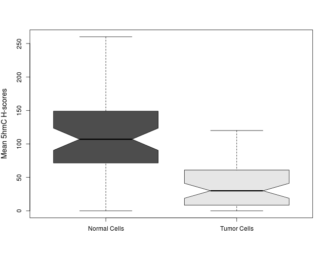 

```r
# Plotting a violin plot
require(vioplot)
vioplot(n.5hmc.m, t.5hmc.m,
        col = "gray",
        rectCol = "white", colMed = "black",
        names = c("Normal Cells", "Tumor Cells")
        )
title(ylab = "Mean 5hmC H-scores", cex.lab = 1.2)
```

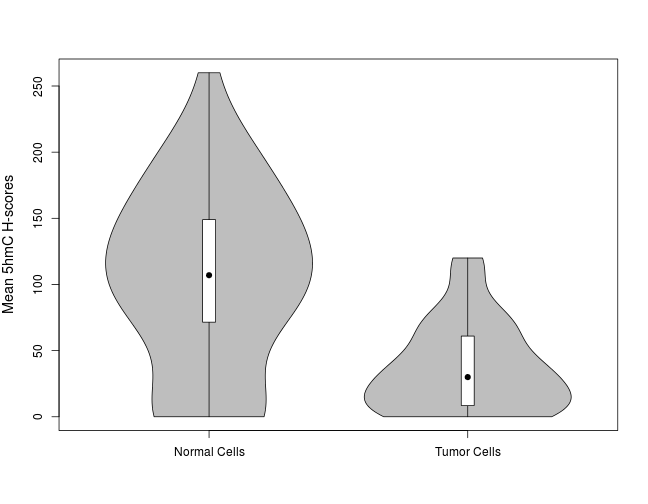 

* Median H-scores

```r
# Comparing median H-scores in nontumor and tumor tissues
compare.mw2(n.5hmc.med, t.5hmc.med)
```

```
##        Median  IQR
## Var #1    105 77.5
## Var #2     30 45.0
## 
## Mann-Whitney's P value = 8.311e-07
```

```r
# Ploting a boxplot
boxplot(n.5hmc.med, t.5hmc.med, notch = TRUE, 
        ylab = "Median 5hmC H-scores", cex.lab = 1.2,
        col = gray.colors(2),
        names = c("Normal Cells", "Tumor Cells")
        )
```

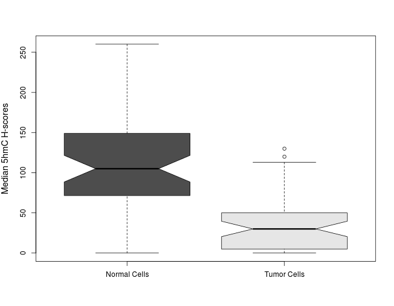 

```r
# Plotting a violin plot
require(vioplot)
vioplot(n.5hmc.med, t.5hmc.med,
        col = "gray",
        rectCol = "white", colMed = "black",
        names = c("Normal Cells", "Tumor Cells")
        )
title(ylab = "Median 5hmC H-scores", cex.lab = 1.2)
```

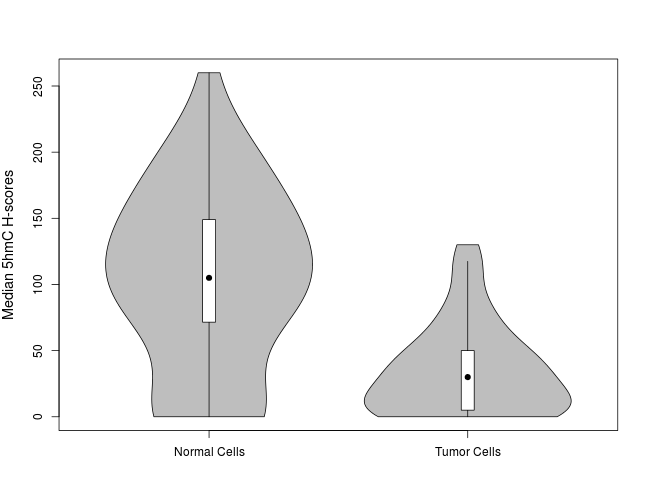 

In addition, we will compare mean and median 5hmC scores between noninvasive and invasive tumors. Mean and median H-scores will be obtained from `t.5hmc.m` and `t.5hmc.med` (respectively), using `spot.dx` to identify which cases corresponded to noninvasive or invasive tumors. Regarding the latter, in some cases there was a discrepancy between the diagnosis given in the pathology report (as specified in `histo.dx`) and what was found at the TMA spot (specified in `spot.dx`). The following table shows what was found at the TMA spots.

```r
table.prop(spot.dx)
```

```
##             Count Percentages
## Invasive       48        87.3
## Noninvasive     5         9.1
## Normal          2         3.6
```
Thus, for the next comparisons and plots we will use only the `Invasive` and `Noninvasive` cases.
* Mean H-scores

```r
# Selecting only invasive and noninvasive cases from spot.dx
mean.5hmc.invasive <- t.5hmc.m[spot.dx == "Invasive"]
mean.5hmc.noninvasive <- t.5hmc.m[spot.dx == "Noninvasive"]
# Comparing median H-scores in nontumor and tumor tissues
compare.mw2(mean.5hmc.invasive, mean.5hmc.noninvasive)
```

```
##        Median  IQR
## Var #1     30 42.5
## Var #2     30 37.0
## 
## Mann-Whitney's P value = 0.6587
```

```r
# Ploting a boxplot
boxplot(mean.5hmc.invasive, mean.5hmc.noninvasive, notch = TRUE, 
        ylab = "Mean 5hmC H-scores", cex.lab = 1.2,
        col = gray.colors(2),
        names = c("Invasive Tumors", "Noninvasive Tumors")
        )
```

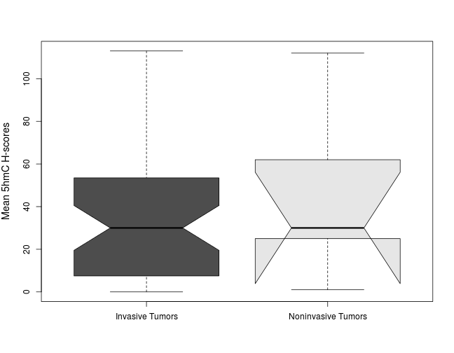 

```r
# Plotting a violin plot
require(vioplot)
vioplot(mean.5hmc.invasive, mean.5hmc.noninvasive,
        col = "gray",
        rectCol = "white", colMed = "black",
        names = c("Invasive Tumors", "Noninvasive Tumors")
        )
title(ylab = "Mean 5hmC H-scores", cex.lab = 1.2)
```

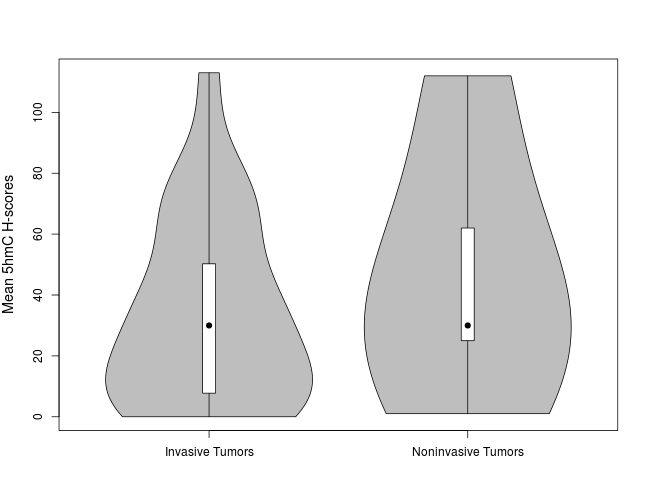 

* Median H-scores

```r
# Selecting only invasive and noninvasive cases from spot.dx
median.5hmc.invasive <- t.5hmc.med[spot.dx == "Invasive"]
median.5hmc.noninvasive <- t.5hmc.med[spot.dx == "Noninvasive"]
# Comparing median H-scores in nontumor and tumor tissues
compare.mw2(median.5hmc.invasive, median.5hmc.noninvasive)
```

```
##        Median IQR
## Var #1   27.5  45
## Var #2   30.0  25
## 
## Mann-Whitney's P value = 0.603
```

```r
# Ploting a boxplot
boxplot(median.5hmc.invasive, median.5hmc.noninvasive, notch = TRUE, 
        ylab = "Median 5hmC H-scores", cex.lab = 1.2,
        col = gray.colors(2),
        names = c("Invasive Tumors", "Noninvasive Tumors")
        )
```

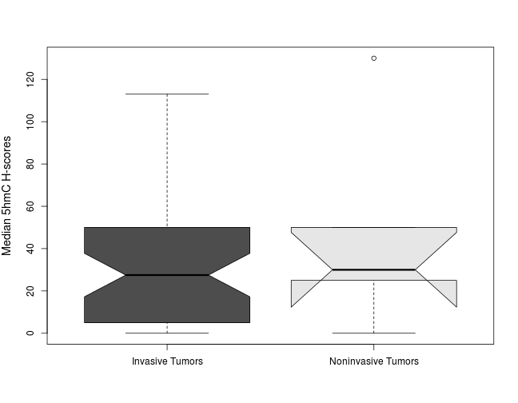 

```r
# Plotting a violin plot
require(vioplot)
vioplot(median.5hmc.invasive, median.5hmc.noninvasive,
        col = "gray",
        rectCol = "white", colMed = "black",
        names = c("Invasive Tumors", "Noninvasive Tumors")
        )
title(ylab = "Median 5hmC H-scores", cex.lab = 1.2)
```

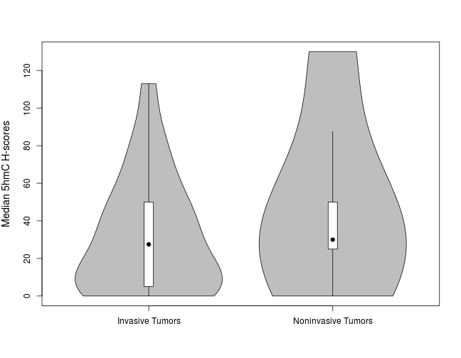 

***

### 5hmC expression and outcome
For this section we will use 3 different approaches for evaluating the association of 5hmC and outcome: 1) using 5hmC H-scores; 2) categorizing 5hmC expression in low/high levels using the median as the cutoff point; 3) categorizing 5hmC expression in low/high levels using the Q3 as the cutoff point.

Only invasive cases will be consider from now on, as observed at the TMA spot (i.e., `spot.dx == Invasive`).

```r
invasive <- subset(data, spot.dx == "Invasive")
detach(data)
attach(invasive)
```
The number of invasive cases is N = 48. Also, only median H-scores will be consider for analysis.

#### Approach #1
In this approach we will compare 5hmC `H-scores` against clinicopathologic features and outcome. Comparisons will be made using the Mann-Whitney U test. For age (numeric variable) we will use the median to define younger and older age groups.

```r
# 5hmC and patient's age
age.group <- ifelse(age > median(age), c("Older age"), c("Younger age"))
compare.mw(t.5hmc.med, age.group)
```

```
##             Median IQR
## Older age     12.5  40
## Younger age   30.0  40
## 
## Mann-Whitney's P value = 0.4185
```

```r
# 5hmC and patient's sex
compare.mw(t.5hmc.med, sex)
```

```
##        Median  IQR
## Female   35.0 43.8
## Male     12.5 38.8
## 
## Mann-Whitney's P value = 0.4211
```

```r
# 5hmC and patient's race
compare.mw(t.5hmc.med, race)
```

```
##                  Median  IQR
## African-American     40 50.0
## Caucasian            25 42.5
## 
## Mann-Whitney's P value = 0.4449
```

```r
# 5hmC and pT stage at cystectomy
compare.kw(t.5hmc.med, pt.cystectomy)
```

```
##        Median  IQR
## T1       15.0 62.0
## T2       47.5 22.5
## T2a      35.0 15.0
## T2b      42.5 61.2
## T3       61.5 51.5
## T3a      10.0 25.0
## T3b      10.0 42.5
## T4a       5.0 22.5
## Tis-Ta     NA   NA
## 
## Mann-Whitney's P value = 0.3144
```

```r
# 5hmC and clinical stage at cystectomy
compare.kw(t.5hmc.med, stage.cystectomy)
```

```
##     Median  IQR
## I       15 62.0
## II      35 28.8
## III     10 35.0
## IV      30 50.0
## 
## Mann-Whitney's P value = 0.3525
```

```r
# 5hmC and lymphovascular invasion
compare.mw(t.5hmc.med, lvi)
```

```
##     Median  IQR
## No    27.5 35.0
## Yes   20.0 48.8
## 
## Mann-Whitney's P value = 0.9912
```

```r
# 5hmC and lymph node metastasis
compare.mw(t.5hmc.med, ln.met)
```

```
##     Median IQR
## No      30  50
## Yes     10  38
## 
## Mann-Whitney's P value = 0.1839
```

```r
# 5hmC and early complications
compare.mw(t.5hmc.med, comp.early)
```

```
##     Median  IQR
## No      30 45.0
## Yes     20 33.8
## 
## Mann-Whitney's P value = 0.6297
```

```r
# 5hmC and late complications
compare.mw(t.5hmc.med, comp.late)
```

```
##     Median IQR
## No      10  35
## Yes     35  50
## 
## Mann-Whitney's P value = 0.1519
```

```r
# 5hmC and metastatic disease after cystectomy
compare.mw(t.5hmc.med, metastasis)
```

```
##     Median  IQR
## No    27.5 52.5
## Yes   10.0 31.5
## 
## Mann-Whitney's P value = 0.3827
```

```r
# 5hmC and overall mortality
compare.mw(t.5hmc.med, death)
```

```
##     Median  IQR
## No    17.5 37.5
## Yes   30.0 43.8
## 
## Mann-Whitney's P value = 0.8754
```

```r
# 5hmC and cancer-related mortality
compare.mw(t.5hmc.med, dod)
```

```
##     Median IQR
## No    32.5  40
## Yes   15.0  34
## 
## Mann-Whitney's P value = 0.3527
```

```r
# 5hmC and tumor progression
compare.mw(t.5hmc.med, progression)
```

```
##     Median IQR
## No      35  50
## Yes     15  34
## 
## Mann-Whitney's P value = 0.1948
```

#### Approach # 2
In this approach we will compare 5hmC levels (categorizing 5hmC expression in low/high levels using the `median` as the cutoff point) against clinicopathologic features and outcome. Comparisons will be made using the Fisher's exact test. For age (numeric variable) we will use the median to define younger and older age groups.

```r
# Categorizing 5hmC expression
med.5hmc <- ifelse(t.5hmc.med > median(t.5hmc.med), c("High"), c("Low"))
# 5hmC and patient's age
compare.fisher(med.5hmc, age.group)
```

```
## **Table of Frequencies**
##       Column
## Row    Older age Younger age
##   High        11          13
##   Low         13          11
## 
## **Row Percentages**
##       Column
## Row    Older age Younger age
##   High        46          54
##   Low         54          46
## 
## **Column Percentages**
##       Column
## Row    Older age Younger age
##   High        46          54
##   Low         54          46
## 
## Fisher's P value = 0.7732
```

```r
# 5hmC and patient's sex
compare.fisher(med.5hmc, sex)
```

```
## **Table of Frequencies**
##       Column
## Row    Female Male
##   High      6   18
##   Low       4   20
## 
## **Row Percentages**
##       Column
## Row    Female Male
##   High     25   75
##   Low      17   83
## 
## **Column Percentages**
##       Column
## Row    Female Male
##   High     60   47
##   Low      40   53
## 
## Fisher's P value = 0.7238
```

```r
# 5hmC and patient's race
compare.fisher(med.5hmc, race)
```

```
## **Table of Frequencies**
##       Column
## Row    African-American Caucasian
##   High                3        21
##   Low                 2        22
## 
## **Row Percentages**
##       Column
## Row    African-American Caucasian
##   High               12        88
##   Low                 8        92
## 
## **Column Percentages**
##       Column
## Row    African-American Caucasian
##   High               60        49
##   Low                40        51
## 
## Fisher's P value = 1
```

```r
# 5hmC and pT stage at cystectomy
compare.fisher(med.5hmc, pt.cystectomy)
```

```
## **Table of Frequencies**
##       Column
## Row    T1 T2 T2a T2b T3 T3a T3b T4a Tis-Ta
##   High  2  3   2   6  1   5   3   2      0
##   Low   3  1   1   4  1   6   4   4      0
## 
## **Row Percentages**
##       Column
## Row    T1 T2 T2a T2b T3 T3a T3b T4a Tis-Ta
##   High  8 12   8  25  4  21  12   8      0
##   Low  12  4   4  17  4  25  17  17      0
## 
## **Column Percentages**
##       Column
## Row     T1  T2 T2a T2b  T3 T3a T3b T4a Tis-Ta
##   High  40  75  67  60  50  45  43  33       
##   Low   60  25  33  40  50  55  57  67       
## 
## Fisher's P value = 0.9294
```

```r
# 5hmC and clinical stage at cystectomy
compare.fisher(med.5hmc, stage.cystectomy)
```

```
## **Table of Frequencies**
##       Column
## Row     I II III IV
##   High  2  8   6  8
##   Low   3  4  10  7
## 
## **Row Percentages**
##       Column
## Row     I II III IV
##   High  8 33  25 33
##   Low  12 17  42 29
## 
## **Column Percentages**
##       Column
## Row     I II III IV
##   High 40 67  38 53
##   Low  60 33  62 47
## 
## Fisher's P value = 0.482
```

```r
# 5hmC and lymphovascular invasion
compare.fisher(med.5hmc, lvi)
```

```
## **Table of Frequencies**
##       Column
## Row    No Yes
##   High 16   8
##   Low  16   8
## 
## **Row Percentages**
##       Column
## Row    No Yes
##   High 67  33
##   Low  67  33
## 
## **Column Percentages**
##       Column
## Row    No Yes
##   High 50  50
##   Low  50  50
## 
## Fisher's P value = 1
```

```r
# 5hmC and lymph node metastasis
compare.fisher(med.5hmc, ln.met)
```

```
## **Table of Frequencies**
##       Column
## Row    No Yes
##   High 21   3
##   Low  18   6
## 
## **Row Percentages**
##       Column
## Row    No Yes
##   High 88  12
##   Low  75  25
## 
## **Column Percentages**
##       Column
## Row    No Yes
##   High 54  33
##   Low  46  67
## 
## Fisher's P value = 0.4614
```

```r
# 5hmC and early complications
compare.fisher(med.5hmc, comp.early)
```

```
## **Table of Frequencies**
##       Column
## Row    No Yes
##   High 16   8
##   Low  14  10
## 
## **Row Percentages**
##       Column
## Row    No Yes
##   High 67  33
##   Low  58  42
## 
## **Column Percentages**
##       Column
## Row    No Yes
##   High 53  44
##   Low  47  56
## 
## Fisher's P value = 0.7661
```

```r
# 5hmC and late complications
compare.fisher(med.5hmc, comp.late)
```

```
## **Table of Frequencies**
##       Column
## Row    No Yes
##   High 11  13
##   Low  14  10
## 
## **Row Percentages**
##       Column
## Row    No Yes
##   High 46  54
##   Low  58  42
## 
## **Column Percentages**
##       Column
## Row    No Yes
##   High 44  57
##   Low  56  43
## 
## Fisher's P value = 0.5639
```

```r
# 5hmC and metastatic disease after cystectomy
compare.fisher(med.5hmc, metastasis)
```

```
## **Table of Frequencies**
##       Column
## Row    No Yes
##   High 15   6
##   Low  15   9
## 
## **Row Percentages**
##       Column
## Row    No Yes
##   High 71  29
##   Low  62  38
## 
## **Column Percentages**
##       Column
## Row    No Yes
##   High 50  40
##   Low  50  60
## 
## Fisher's P value = 0.752
```

```r
# 5hmC and overall mortality
compare.fisher(med.5hmc, death)
```

```
## **Table of Frequencies**
##       Column
## Row    No Yes
##   High  2  22
##   Low   4  20
## 
## **Row Percentages**
##       Column
## Row    No Yes
##   High  8  92
##   Low  17  83
## 
## **Column Percentages**
##       Column
## Row    No Yes
##   High 33  52
##   Low  67  48
## 
## Fisher's P value = 0.6662
```

```r
# 5hmC and cancer-related mortality
compare.fisher(med.5hmc, dod)
```

```
## **Table of Frequencies**
##       Column
## Row    No Yes
##   High  5  13
##   Low   5  14
## 
## **Row Percentages**
##       Column
## Row    No Yes
##   High 28  72
##   Low  26  74
## 
## **Column Percentages**
##       Column
## Row    No Yes
##   High 50  48
##   Low  50  52
## 
## Fisher's P value = 1
```

```r
# 5hmC and tumor progression
compare.fisher(med.5hmc, progression)
```

```
## **Table of Frequencies**
##       Column
## Row    No Yes
##   High 11  13
##   Low  10  14
## 
## **Row Percentages**
##       Column
## Row    No Yes
##   High 46  54
##   Low  42  58
## 
## **Column Percentages**
##       Column
## Row    No Yes
##   High 52  48
##   Low  48  52
## 
## Fisher's P value = 1
```

#### Approach # 3
In this approach we will compare 5hmC levels (categorizing 5hmC expression in low/high levels using the `upper tertile` as the cutoff point) against clinicopathologic features and outcome. Comparisons will be made using the Fisher's exact test. For age (numeric variable) we will use the median to define younger and older age groups.

```r
# Categorizing 5hmC expression
q3.5hmc <- ifelse(t.5hmc.med > quantile(t.5hmc.med, .75, na.rm = TRUE), c("High"), c("Low"))
# 5hmC and patient's age
compare.fisher(q3.5hmc, age.group)
```

```
## **Table of Frequencies**
##       Column
## Row    Older age Younger age
##   High         6           4
##   Low         18          20
## 
## **Row Percentages**
##       Column
## Row    Older age Younger age
##   High        60          40
##   Low         47          53
## 
## **Column Percentages**
##       Column
## Row    Older age Younger age
##   High        25          17
##   Low         75          83
## 
## Fisher's P value = 0.7238
```

```r
# 5hmC and patient's sex
compare.fisher(q3.5hmc, sex)
```

```
## **Table of Frequencies**
##       Column
## Row    Female Male
##   High      3    7
##   Low       7   31
## 
## **Row Percentages**
##       Column
## Row    Female Male
##   High     30   70
##   Low      18   82
## 
## **Column Percentages**
##       Column
## Row    Female Male
##   High     30   18
##   Low      70   82
## 
## Fisher's P value = 0.4143
```

```r
# 5hmC and patient's race
compare.fisher(q3.5hmc, race)
```

```
## **Table of Frequencies**
##       Column
## Row    African-American Caucasian
##   High                2         8
##   Low                 3        35
## 
## **Row Percentages**
##       Column
## Row    African-American Caucasian
##   High               20        80
##   Low                 8        92
## 
## **Column Percentages**
##       Column
## Row    African-American Caucasian
##   High               40        19
##   Low                60        81
## 
## Fisher's P value = 0.2758
```

```r
# 5hmC and pT stage at cystectomy
compare.fisher(q3.5hmc, pt.cystectomy)
```

```
## **Table of Frequencies**
##       Column
## Row    T1 T2 T2a T2b T3 T3a T3b T4a Tis-Ta
##   High  2  1   0   4  1   0   1   1      0
##   Low   3  3   3   6  1  11   6   5      0
## 
## **Row Percentages**
##       Column
## Row    T1 T2 T2a T2b T3 T3a T3b T4a Tis-Ta
##   High 20 10   0  40 10   0  10  10      0
##   Low   8  8   8  16  3  29  16  13      0
## 
## **Column Percentages**
##       Column
## Row     T1  T2 T2a T2b  T3 T3a T3b T4a Tis-Ta
##   High  40  25   0  40  50   0  14  17       
##   Low   60  75 100  60  50 100  86  83       
## 
## Fisher's P value = 0.1916
```

```r
# 5hmC and clinical stage at cystectomy
compare.fisher(q3.5hmc, stage.cystectomy)
```

```
## **Table of Frequencies**
##       Column
## Row     I II III IV
##   High  2  2   2  4
##   Low   3 10  14 11
## 
## **Row Percentages**
##       Column
## Row     I II III IV
##   High 20 20  20 40
##   Low   8 26  37 29
## 
## **Column Percentages**
##       Column
## Row     I II III IV
##   High 40 17  12 27
##   Low  60 83  88 73
## 
## Fisher's P value = 0.4738
```

```r
# 5hmC and lymphovascular invasion
compare.fisher(q3.5hmc, lvi)
```

```
## **Table of Frequencies**
##       Column
## Row    No Yes
##   High  6   4
##   Low  26  12
## 
## **Row Percentages**
##       Column
## Row    No Yes
##   High 60  40
##   Low  68  32
## 
## **Column Percentages**
##       Column
## Row    No Yes
##   High 19  25
##   Low  81  75
## 
## Fisher's P value = 0.7118
```

```r
# 5hmC and lymph node metastasis
compare.fisher(q3.5hmc, ln.met)
```

```
## **Table of Frequencies**
##       Column
## Row    No Yes
##   High 10   0
##   Low  29   9
## 
## **Row Percentages**
##       Column
## Row     No Yes
##   High 100   0
##   Low   76  24
## 
## **Column Percentages**
##       Column
## Row     No Yes
##   High  26   0
##   Low   74 100
## 
## Fisher's P value = 0.1722
```

```r
# 5hmC and early complications
compare.fisher(q3.5hmc, comp.early)
```

```
## **Table of Frequencies**
##       Column
## Row    No Yes
##   High  7   3
##   Low  23  15
## 
## **Row Percentages**
##       Column
## Row    No Yes
##   High 70  30
##   Low  61  39
## 
## **Column Percentages**
##       Column
## Row    No Yes
##   High 23  17
##   Low  77  83
## 
## Fisher's P value = 0.7222
```

```r
# 5hmC and late complications
compare.fisher(q3.5hmc, comp.late)
```

```
## **Table of Frequencies**
##       Column
## Row    No Yes
##   High  3   7
##   Low  22  16
## 
## **Row Percentages**
##       Column
## Row    No Yes
##   High 30  70
##   Low  58  42
## 
## **Column Percentages**
##       Column
## Row    No Yes
##   High 12  30
##   Low  88  70
## 
## Fisher's P value = 0.1615
```

```r
# 5hmC and metastatic disease after cystectomy
compare.fisher(q3.5hmc, metastasis)
```

```
## **Table of Frequencies**
##       Column
## Row    No Yes
##   High  8   2
##   Low  22  13
## 
## **Row Percentages**
##       Column
## Row    No Yes
##   High 80  20
##   Low  63  37
## 
## **Column Percentages**
##       Column
## Row    No Yes
##   High 27  13
##   Low  73  87
## 
## Fisher's P value = 0.4556
```

```r
# 5hmC and overall mortality
compare.fisher(q3.5hmc, death)
```

```
## **Table of Frequencies**
##       Column
## Row    No Yes
##   High  1   9
##   Low   5  33
## 
## **Row Percentages**
##       Column
## Row    No Yes
##   High 10  90
##   Low  13  87
## 
## **Column Percentages**
##       Column
## Row    No Yes
##   High 17  21
##   Low  83  79
## 
## Fisher's P value = 1
```

```r
# 5hmC and cancer-related mortality
compare.fisher(q3.5hmc, dod)
```

```
## **Table of Frequencies**
##       Column
## Row    No Yes
##   High  2   4
##   Low   8  23
## 
## **Row Percentages**
##       Column
## Row    No Yes
##   High 33  67
##   Low  26  74
## 
## **Column Percentages**
##       Column
## Row    No Yes
##   High 20  15
##   Low  80  85
## 
## Fisher's P value = 0.6527
```

```r
# 5hmC and tumor progression
compare.fisher(q3.5hmc, progression)
```

```
## **Table of Frequencies**
##       Column
## Row    No Yes
##   High  6   4
##   Low  15  23
## 
## **Row Percentages**
##       Column
## Row    No Yes
##   High 60  40
##   Low  39  61
## 
## **Column Percentages**
##       Column
## Row    No Yes
##   High 29  15
##   Low  71  85
## 
## Fisher's P value = 0.2974
```

***

### Survival plots
In this section we will plot survival curves for overall mortality and cancer-related mortality according to 5hmC expression, categorizing 5hmC expression in low/high levels using as cutoff points: 1) the median; 2) the upper tertile. We will use `follow-up from cystectomy` for the time-to-event analysis.

* Defining survival objects

```r
death.surv <- Surv(fu.cystectomy, as.numeric(death))
dod.surv <- Surv(fu.cystectomy, as.numeric(dod))
```

#### Approach #1
In this approch we will plot `Kaplan-Meier curves` for overall mortality and cancer-related mortality using the `median` H-score as the cutoff point for defining low/high 5hmC levels. We will compare survival curves using the `log-rank test`.

* Overall mortality

```r
# Estimating P values using the log-rank test
death.med.lr <- survdiff(death.surv ~ med.5hmc)
death.med.p <- pchisq(death.med.lr$chisq, df = 1, lower = FALSE)
# Plotting curves
survival.plot(x = survfit(death.surv ~ med.5hmc), title = "Overall Mortality and 5hmC Expression", levels = c("High", "Low"))
text(paste("P (log-rank test) = ", round(death.med.p, digits = 3)), x = 35, y = 0.01, cex = 1.25)
```

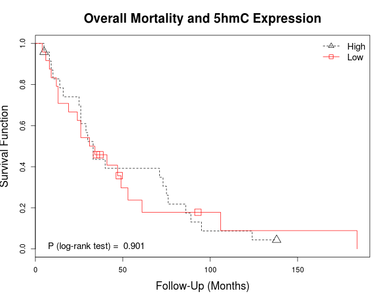 

* Cancer-related mortality

```r
# Estimating P values using the log-rank test
dod.med.lr <- survdiff(dod.surv ~ med.5hmc)
dod.med.p <- pchisq(dod.med.lr$chisq, df = 1, lower = FALSE)
# Plotting curves
survival.plot(x = survfit(dod.surv ~ med.5hmc), title = "Cancer-Related Mortality and 5hmC Expression", levels = c("High", "Low"))
text(paste("P (log-rank test) = ", round(dod.med.p, digits = 3)), x = 35, y = 0.01, cex = 1.25)
```

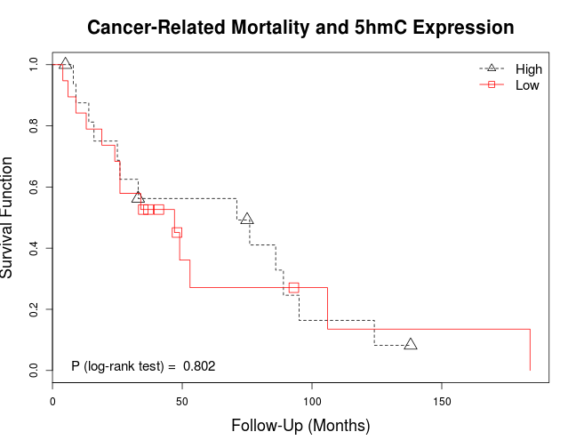 

#### Approach #2
In this approch we will plot `Kaplan-Meier curves` for overall mortality and cancer-related mortality using the upper tertile `Q3` H-score as the cutoff point for defining low/high 5hmC levels. We will compare survival curves using the `log-rank test`.

* Overall mortality

```r
# Estimating P values using the log-rank test
death.q3.lr <- survdiff(death.surv ~ q3.5hmc)
death.q3.p <- pchisq(death.q3.lr$chisq, df = 1, lower = FALSE)
# Plotting curves
survival.plot(x = survfit(death.surv ~ q3.5hmc), title = "Overall Mortality and 5hmC Expression", levels = c("High", "Low"))
text(paste("P (log-rank test) = ", round(death.q3.p, digits = 3)), x = 35, y = 0.01, cex = 1.25)
```

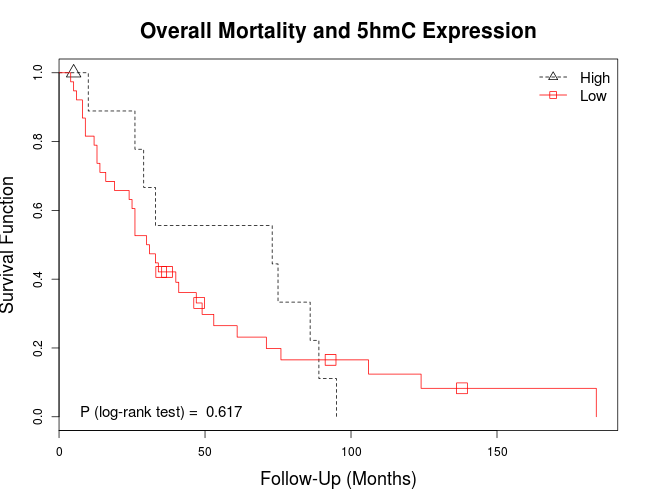 

* Cancer-related mortality

```r
# Estimating P values using the log-rank test
dod.q3.lr <- survdiff(dod.surv ~ med.5hmc)
dod.q3.p <- pchisq(dod.med.lr$chisq, df = 1, lower = FALSE)
# Plotting curves
survival.plot(x = survfit(dod.surv ~ q3.5hmc), title = "Cancer-Related Mortality and 5hmC Expression", levels = c("High", "Low"))
text(paste("P (log-rank test) = ", round(dod.q3.p, digits = 3)), x = 35, y = 0.01, cex = 1.25)
```

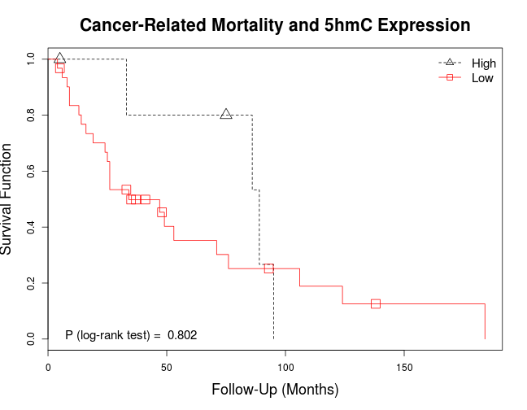 

***

### Logistic regression models for predicting outcome
In this section we will built logistic regression models for predicing overall mortality, cancer-related mortality, metastatic disease, and tumor progression using 5hmC expression. As before, we will categore 5hmC expression in low/high levels using as cutoff points: 1) the median; 2) the upper tertile. For each approach we will present 4 models, for each outcome: 1) unadjusted model; model adjusted by clinical features; 3) model adjusted by pathologic features; 4) model adjusted by clinical and pahtologic features.

**Clinical features** to be used for adjustment include age group, sex, and race. **Pathologic features** to be used for adjustment include high pT stage (>pT2, see below), CIS, lymphovascular invasion, and lymph node metastasis.


```r
# Categorizing pT stages in low/high pT stage
high.pt <- ifelse(pt.cystectomy == "Tis-Ta" | pt.cystectomy == "T1" | pt.cystectomy == "T2" | pt.cystectomy == "T2a" | pt.cystectomy == "T2b", c("Low pT stage"), c("High pT stage"))
```

#### Approach #1
In this approach we will estimate `odds ratios` for overall mortality, cancer-related mortality, metastatic disease, and tumor progression using 5hmC expression categorized in low/high levels using the `median`as the cutoff point.

* Overall mortality

```r
# Unadjusted model
logistic(death ~ med.5hmc, invasive)
```

```
##             Odds Ratio   2.5 % 97.5 %  P value
## (Intercept)    11.0000 3.24309 68.662 0.001167
## med.5hmcLow     0.4545 0.05839  2.593 0.391170
```

```r
# Model adjusted by clinical features
logistic(death ~ med.5hmc + age.group + sex + race, invasive)
```

```
##                      Odds Ratio     2.5 %    97.5 % P value
## (Intercept)           4.737e+08 3.014e-90        NA 0.99345
## med.5hmcLow           1.659e-01 6.714e-03 1.474e+00 0.15796
## age.groupYounger age  2.737e-01 2.345e-02 2.015e+00 0.23100
## sexMale               2.149e+01 2.074e+00 5.575e+02 0.02029
## raceCaucasian         8.458e-09        NA 8.496e+65 0.99391
```

```r
# Model adjusted by pathologic features
logistic(death ~ med.5hmc + high.pt + cis + lvi + ln.met, invasive)
```

```
##                     Odds Ratio     2.5 %  97.5 % P value
## (Intercept)          2.532e+01 3.161e+00 537.169  0.0111
## med.5hmcLow          3.304e-01 3.665e-02   2.175  0.2672
## high.ptLow pT stage  8.206e-01 1.027e-01   6.439  0.8458
## cisYes               2.421e-01 2.836e-02   1.522  0.1448
## lviYes               6.953e-01 8.780e-02   6.642  0.7298
## ln.metYes            3.742e+07 6.086e-83      NA  0.9933
```

```r
# Model adjusted by clinical and pathologic features
logistic(death ~ med.5hmc + age.group + sex + race + high.pt + cis + lvi + ln.met, invasive)
```

```
##                      Odds Ratio      2.5 % 97.5 % P value
## (Intercept)           1.834e+09  0.000e+00     NA  0.9982
## med.5hmcLow           1.424e-01  4.859e-03  1.706  0.1608
## age.groupYounger age  4.072e-01  2.544e-02  4.406  0.4734
## sexMale               2.259e+09 2.286e-183     NA  0.9962
## raceCaucasian         2.341e-17         NA    Inf  0.9971
## high.ptLow pT stage   2.291e+00  1.457e-01 64.981  0.5726
## cisYes                9.445e-02  2.597e-03  1.304  0.1138
## lviYes                1.096e+08 2.095e-161     NA  0.9967
## ln.metYes             1.306e+16        Inf    Inf  0.9963
```

* Cancer-related mortality

```r
# Unadjusted model
logistic(dod ~ med.5hmc, invasive)
```

```
##             Odds Ratio  2.5 % 97.5 % P value
## (Intercept)      2.600 0.9806  8.104 0.06941
## med.5hmcLow      1.077 0.2458  4.726 0.92028
```

```r
# Model adjusted by clinical features
logistic(dod ~ med.5hmc + age.group + sex + race, invasive)
```

```
##                      Odds Ratio   2.5 %  97.5 % P value
## (Intercept)              0.9266 0.05696  15.080 0.95446
## med.5hmcLow              0.5805 0.08098   3.331 0.55314
## age.groupYounger age     0.2386 0.02861   1.350 0.12904
## sexMale                 10.6907 1.63169 106.212 0.02086
## raceCaucasian            1.6720 0.11360  22.762 0.68957
```

```r
# Model adjusted by pathologic features
logistic(dod ~ med.5hmc + high.pt + cis + lvi + ln.met, invasive)
```

```
##                     Odds Ratio   2.5 %  97.5 % P value
## (Intercept)             6.6322 1.44693  46.562 0.02833
## med.5hmcLow             0.8743 0.17029   4.375 0.86846
## high.ptLow pT stage     0.5927 0.08998   3.712 0.56974
## cisYes                  0.4318 0.07374   2.304 0.32830
## lviYes                  0.2891 0.04377   1.566 0.16266
## ln.metYes               5.6701 0.59174 148.170 0.18920
```

```r
# Model adjusted by clinical and pathologic features
logistic(dod ~ med.5hmc + age.group + sex + race + high.pt + cis + lvi + ln.met, invasive)
```

```
##                      Odds Ratio    2.5 %    97.5 % P value
## (Intercept)             0.26051 0.003602 1.490e+01 0.50800
## med.5hmcLow             0.37889 0.031077 3.418e+00 0.40131
## age.groupYounger age    0.13067 0.008675 1.056e+00 0.08457
## sexMale                26.54064 1.510458 1.729e+03 0.05614
## raceCaucasian           9.80266 0.402775 3.427e+02 0.16055
## high.ptLow pT stage     4.65102 0.315452 1.544e+02 0.31088
## cisYes                  0.07983 0.002880 9.512e-01 0.07529
## lviYes                  0.94636 0.053723 1.866e+01 0.96915
## ln.metYes              45.11639 1.047353 3.295e+04 0.12773
```

* Metastatic disease

```r
# Unadjusted model
logistic(metastasis ~ med.5hmc, invasive)
```

```
##             Odds Ratio  2.5 % 97.5 % P value
## (Intercept)        0.4 0.1426  0.984 0.05784
## med.5hmcLow        1.5 0.4312  5.486 0.52714
```

```r
# Model adjusted by clinical features
logistic(metastasis ~ med.5hmc + age.group + sex + race, invasive)
```

```
##                      Odds Ratio    2.5 % 97.5 % P value
## (Intercept)              0.5186 0.042353  5.466  0.5746
## med.5hmcLow              1.4948 0.413518  5.727  0.5435
## age.groupYounger age     1.3413 0.366442  4.971  0.6552
## sexMale                  3.5551 0.488011 75.516  0.2801
## raceCaucasian            0.2005 0.007512  2.685  0.2417
```

```r
# Model adjusted by pathologic features
logistic(metastasis ~ med.5hmc + high.pt + cis + lvi + ln.met, invasive)
```

```
##                     Odds Ratio   2.5 % 97.5 % P value
## (Intercept)             0.2347 0.04646 0.9337 0.05354
## med.5hmcLow             1.6912 0.45445 6.7712 0.43931
## high.ptLow pT stage     1.6752 0.44017 6.5749 0.44816
## cisYes                  1.8564 0.49957 7.0693 0.35419
## lviYes                  0.8290 0.17900 3.4621 0.79992
## ln.metYes               1.0189 0.16912 5.3559 0.98253
```

```r
# Model adjusted by clinical and pathologic features
logistic(metastasis ~ med.5hmc + age.group + sex + race + high.pt + cis + lvi + ln.met, invasive)
```

```
##                      Odds Ratio    2.5 % 97.5 % P value
## (Intercept)              0.3098 0.014838  4.484  0.3958
## med.5hmcLow              1.6784 0.427362  7.178  0.4643
## age.groupYounger age     1.1752 0.294243  4.667  0.8164
## sexMale                  3.7827 0.458377 86.217  0.2774
## raceCaucasian            0.1849 0.006436  2.810  0.2378
## high.ptLow pT stage      1.5204 0.374515  6.333  0.5551
## cisYes                   2.0687 0.540167  8.356  0.2916
## lviYes                   1.0091 0.198897  4.735  0.9909
## ln.metYes                1.0049 0.146420  5.659  0.9957
```

* Tumor progression

```r
# Unadjusted model
logistic(death ~ med.5hmc, invasive)
```

```
##             Odds Ratio   2.5 % 97.5 %  P value
## (Intercept)    11.0000 3.24309 68.662 0.001167
## med.5hmcLow     0.4545 0.05839  2.593 0.391170
```

```r
# Model adjusted by clinical features
logistic(death ~ med.5hmc + age.group + sex + race, invasive)
```

```
##                      Odds Ratio     2.5 %    97.5 % P value
## (Intercept)           4.737e+08 3.014e-90        NA 0.99345
## med.5hmcLow           1.659e-01 6.714e-03 1.474e+00 0.15796
## age.groupYounger age  2.737e-01 2.345e-02 2.015e+00 0.23100
## sexMale               2.149e+01 2.074e+00 5.575e+02 0.02029
## raceCaucasian         8.458e-09        NA 8.496e+65 0.99391
```

```r
# Model adjusted by pathologic features
logistic(death ~ med.5hmc + high.pt + cis + lvi + ln.met, invasive)
```

```
##                     Odds Ratio     2.5 %  97.5 % P value
## (Intercept)          2.532e+01 3.161e+00 537.169  0.0111
## med.5hmcLow          3.304e-01 3.665e-02   2.175  0.2672
## high.ptLow pT stage  8.206e-01 1.027e-01   6.439  0.8458
## cisYes               2.421e-01 2.836e-02   1.522  0.1448
## lviYes               6.953e-01 8.780e-02   6.642  0.7298
## ln.metYes            3.742e+07 6.086e-83      NA  0.9933
```

```r
# Model adjusted by clinical and pathologic features
logistic(death ~ med.5hmc + age.group + sex + race + high.pt + cis + lvi + ln.met, invasive)
```

```
##                      Odds Ratio      2.5 % 97.5 % P value
## (Intercept)           1.834e+09  0.000e+00     NA  0.9982
## med.5hmcLow           1.424e-01  4.859e-03  1.706  0.1608
## age.groupYounger age  4.072e-01  2.544e-02  4.406  0.4734
## sexMale               2.259e+09 2.286e-183     NA  0.9962
## raceCaucasian         2.341e-17         NA    Inf  0.9971
## high.ptLow pT stage   2.291e+00  1.457e-01 64.981  0.5726
## cisYes                9.445e-02  2.597e-03  1.304  0.1138
## lviYes                1.096e+08 2.095e-161     NA  0.9967
## ln.metYes             1.306e+16        Inf    Inf  0.9963
```

#### Approach #2
In this approach we will estimate `odds ratios` for overall mortality, cancer-related mortality, metastatic disease, and tumor progression using 5hmC expression categorized in low/high levels using the upper tertile `q3` as the cutoff point.

* Overall mortality

```r
# Unadjusted model
logistic(death ~ q3.5hmc, invasive)
```

```
##             Odds Ratio   2.5 %  97.5 % P value
## (Intercept)     9.0000 1.69147 165.978  0.0371
## q3.5hmcLow      0.7333 0.03588   5.368  0.7888
```

```r
# Model adjusted by clinical features
logistic(death ~ q3.5hmc + age.group + sex + race, invasive)
```

```
##                      Odds Ratio     2.5 %     97.5 % P value
## (Intercept)           1.312e+08 3.350e-89         NA 0.99449
## q3.5hmcLow            8.277e-01 3.381e-02  8.190e+00 0.88345
## age.groupYounger age  3.253e-01 2.886e-02  2.353e+00 0.29290
## sexMale               1.018e+01 1.354e+00  9.686e+01 0.02615
## raceCaucasian         1.925e-08        NA 1.686e+102 0.99476
```

```r
# Model adjusted by pathologic features
logistic(death ~ q3.5hmc + high.pt + cis + lvi + ln.met, invasive)
```

```
##                     Odds Ratio     2.5 %  97.5 % P value
## (Intercept)          1.817e+01 1.499e+00 586.586 0.04609
## q3.5hmcLow           5.987e-01 2.630e-02   5.791 0.68339
## high.ptLow pT stage  9.276e-01 1.198e-01   7.774 0.94169
## cisYes               2.605e-01 3.025e-02   1.655 0.16862
## lviYes               7.620e-01 1.038e-01   6.965 0.79063
## ln.metYes            3.447e+07 8.560e-84      NA 0.99342
```

```r
# Model adjusted by clinical and pathologic features
logistic(death ~ q3.5hmc + age.group + sex + race + high.pt + cis + lvi + ln.met, invasive)
```

```
##                      Odds Ratio      2.5 % 97.5 % P value
## (Intercept)           5.087e+08  0.000e+00     NA  0.9984
## q3.5hmcLow            6.960e-01  2.699e-02  8.359  0.7874
## age.groupYounger age  5.295e-01  4.003e-02  5.201  0.5907
## sexMale               1.216e+09 6.073e-193     NA  0.9965
## raceCaucasian         4.226e-17         NA    Inf  0.9973
## high.ptLow pT stage   3.035e+00  1.945e-01 85.767  0.4500
## cisYes                1.157e-01  3.216e-03  1.632  0.1504
## lviYes                1.421e+08 2.349e-169     NA  0.9968
## ln.metYes             2.530e+16        Inf    Inf  0.9964
```

* Cancer-related mortality

```r
# Unadjusted model
logistic(dod ~ q3.5hmc, invasive)
```

```
##             Odds Ratio  2.5 % 97.5 % P value
## (Intercept)      2.000 0.3904 14.428  0.4235
## q3.5hmcLow       1.437 0.1753  8.974  0.7049
```

```r
# Model adjusted by clinical features
logistic(dod ~ q3.5hmc + age.group + sex + race, invasive)
```

```
##                      Odds Ratio   2.5 %  97.5 % P value
## (Intercept)              0.9226 0.05751  15.147 0.95182
## q3.5hmcLow               0.7142 0.05200   5.979 0.77097
## age.groupYounger age     0.2711 0.03214   1.554 0.16770
## sexMale                 10.3065 1.56887 106.239 0.02352
## raceCaucasian            1.5951 0.11155  23.150 0.71822
```

```r
# Model adjusted by pathologic features
logistic(dod ~ q3.5hmc + high.pt + cis + lvi + ln.met, invasive)
```

```
##                     Odds Ratio   2.5 %  97.5 % P value
## (Intercept)             4.4984 0.58949  48.901  0.1684
## q3.5hmcLow              1.5244 0.15252  13.598  0.7011
## high.ptLow pT stage     0.6660 0.09880   4.270  0.6631
## cisYes                  0.3778 0.05488   2.245  0.2914
## lviYes                  0.3017 0.04622   1.629  0.1757
## ln.metYes               5.1192 0.54081 132.064  0.2135
```

```r
# Model adjusted by clinical and pathologic features
logistic(dod ~ q3.5hmc + age.group + sex + race + high.pt + cis + lvi + ln.met, invasive)
```

```
##                      Odds Ratio    2.5 %    97.5 % P value
## (Intercept)             0.17005 0.001746    9.8374 0.40505
## q3.5hmcLow              1.28124 0.078339   18.6793 0.85185
## age.groupYounger age    0.16223 0.012320    1.2305 0.10852
## sexMale                23.15495 1.461183 1177.5317 0.05347
## raceCaucasian           8.13895 0.363519  269.1156 0.18815
## high.ptLow pT stage     6.25888 0.370774  287.4565 0.26327
## cisYes                  0.06378 0.001755    0.8809 0.07184
## lviYes                  1.02063 0.064446   18.2668 0.98809
## ln.metYes              21.26644 0.813142 3928.6937 0.13603
```

* Metastatic disease

```r
# Unadjusted model
logistic(metastasis ~ q3.5hmc, invasive)
```

```
##             Odds Ratio   2.5 %  97.5 % P value
## (Intercept)      0.250 0.03773  0.9977 0.07951
## q3.5hmcLow       2.364 0.49655 17.2720 0.31973
```

```r
# Model adjusted by clinical features
logistic(metastasis ~ q3.5hmc + age.group + sex + race, invasive)
```

```
##                      Odds Ratio    2.5 % 97.5 % P value
## (Intercept)              0.3438 0.021902  4.048  0.3992
## q3.5hmcLow               3.1649 0.560033 32.213  0.2415
## age.groupYounger age     1.2852 0.346718  4.808  0.7051
## sexMale                  4.0233 0.520554 93.036  0.2525
## raceCaucasian            0.1297 0.004376  1.960  0.1579
```

```r
# Model adjusted by pathologic features
logistic(metastasis ~ q3.5hmc + high.pt + cis + lvi + ln.met, invasive)
```

```
##                     Odds Ratio   2.5 %  97.5 % P value
## (Intercept)             0.1231 0.01152  0.8582 0.05129
## q3.5hmcLow              2.9295 0.50906 24.5777 0.25983
## high.ptLow pT stage     2.0361 0.50433  8.6179 0.31958
## cisYes                  1.6817 0.44599  6.4314 0.43953
## lviYes                  0.9619 0.20538  4.1705 0.95875
## ln.metYes               0.9131 0.14808  4.9014 0.91670
```

```r
# Model adjusted by clinical and pathologic features
logistic(metastasis ~ q3.5hmc + age.group + sex + race + high.pt + cis + lvi + ln.met, invasive)
```

```
##                      Odds Ratio    2.5 %  97.5 % P value
## (Intercept)              0.1443 0.004602   2.720  0.2145
## q3.5hmcLow               4.5395 0.637631  56.046  0.1693
## age.groupYounger age     1.1285 0.277571   4.526  0.8632
## sexMale                  4.8954 0.543788 126.936  0.2183
## raceCaucasian            0.1042 0.003019   1.870  0.1416
## high.ptLow pT stage      2.0666 0.469698   9.747  0.3403
## cisYes                   1.9569 0.500092   8.074  0.3372
## lviYes                   1.1805 0.226528   5.875  0.8378
## ln.metYes                0.8612 0.123596   4.916  0.8694
```

* Tumor progression

```r
# Unadjusted model
logistic(progression ~ q3.5hmc, invasive)
```

```
##             Odds Ratio  2.5 % 97.5 % P value
## (Intercept)     0.6667 0.1704  2.334  0.5299
## q3.5hmcLow      2.3000 0.5633 10.330  0.2512
```

```r
# Model adjusted by clinical features
logistic(progression ~ q3.5hmc + age.group + sex + race, invasive)
```

```
##                      Odds Ratio   2.5 % 97.5 % P value
## (Intercept)              0.3460 0.02867  3.039 0.35263
## q3.5hmcLow               2.2925 0.51215 11.180 0.28088
## age.groupYounger age     0.4668 0.12599  1.595 0.23380
## sexMale                  4.3568 0.90211 27.148 0.08079
## raceCaucasian            0.8826 0.09914  8.396 0.90784
```

```r
# Model adjusted by pathologic features
logistic(progression ~ q3.5hmc + high.pt + cis + lvi + ln.met, invasive)
```

```
##                     Odds Ratio  2.5 %  97.5 % P value
## (Intercept)             2.8135 0.4775 18.4213 0.25685
## q3.5hmcLow              1.2524 0.2399  6.7166 0.78706
## high.ptLow pT stage     0.1945 0.0448  0.7267 0.01936
## cisYes                  0.9026 0.2361  3.5114 0.88002
## lviYes                  0.4789 0.1120  1.8639 0.29684
## ln.metYes               1.9960 0.3594 13.8401 0.44682
```

```r
# Model adjusted by clinical and pathologic features
logistic(progression ~ q3.5hmc + age.group + sex + race + high.pt + cis + lvi + ln.met, invasive)
```

```
##                      Odds Ratio   2.5 %  97.5 % P value
## (Intercept)              1.1741 0.07204 16.3761 0.90457
## q3.5hmcLow               1.1333 0.20724  6.2974 0.88358
## age.groupYounger age     0.5028 0.11457  2.0041 0.33741
## sexMale                  4.5523 0.76881 35.5065 0.11295
## raceCaucasian            1.0513 0.09155 12.9125 0.96729
## high.ptLow pT stage      0.1990 0.04295  0.7915 0.02728
## cisYes                   0.8135 0.19110  3.4609 0.77630
## lviYes                   0.5788 0.11493  2.7969 0.49241
## ln.metYes                2.5603 0.37625 24.8143 0.36469
```

***

### Cox's proportional hazards regression models for predicting outcome
In this section we will built Cox's models for predicing overall mortality and cancer-related mortality using 5hmC expression. As before, we will categore 5hmC expression in low/high levels using as cutoff points: 1) the median; 2) the upper tertile. For each approach we will present 4 models, for each outcome: 1) unadjusted model; model adjusted by clinical features; 3) model adjusted by pathologic features; 4) model adjusted by clinical and pahtologic features. We will use `follow-up from cystectomy` for the time-to-event analysis.

**Clinical features** to be used for adjustment include age group, sex, and race. **Pathologic features** to be used for adjustment include high pT stage (>pT2, see above), CIS, lymphovascular invasion, and lymph node metastasis.

#### Approach #1
In this approach we will estimate `hazard ratios` for overall mortality, cancer-related mortality, metastatic disease, and tumor progression using 5hmC expression categorized in low/high levels using the `median`as the cutoff point.

* Overall mortality

```r
# Unadjusted model
hazard(death.surv ~ med.5hmc, invasive)
```

```
##      Hazard Ratio Lower 95% CI Upper 95% CI P value
## [1,]         1.04       0.5587        1.934  0.9026
```

```r
# Model adjusted by clinical features
hazard(death.surv ~ med.5hmc + age.group + sex + race, invasive)
```

```
##                      Hazard Ratio Lower 95% CI Upper 95% CI P value
## med.5hmcLow                0.9837       0.5178        1.869  0.9600
## age.groupYounger age       0.9629       0.5044        1.838  0.9088
## sexMale                    1.6597       0.7216        3.817  0.2332
## raceCaucasian              0.8295       0.3031        2.270  0.7159
```

```r
# Model adjusted by pathologic features
hazard(death.surv ~ med.5hmc + high.pt + cis + lvi + ln.met, invasive)
```

```
##                     Hazard Ratio Lower 95% CI Upper 95% CI   P value
## med.5hmcLow               0.9031       0.4723        1.727 0.7578429
## high.ptLow pT stage       1.0206       0.5107        2.040 0.9539268
## cisYes                    0.6241       0.3032        1.285 0.2006093
## lviYes                    0.9276       0.4663        1.846 0.8304747
## ln.metYes                 5.6742       2.1757       14.798 0.0003861
```

```r
# Model adjusted by clinical and pathologic features
hazard(death.surv ~ med.5hmc + age.group + sex + race + high.pt + cis + lvi + ln.met, invasive)
```

```
##                      Hazard Ratio Lower 95% CI Upper 95% CI   P value
## med.5hmcLow                0.7683       0.3932        1.501 0.4406270
## age.groupYounger age       0.7914       0.3869        1.619 0.5216016
## sexMale                    3.0158       1.1274        8.067 0.0278846
## raceCaucasian              1.1651       0.3956        3.432 0.7815638
## high.ptLow pT stage        1.3333       0.6293        2.825 0.4527124
## cisYes                     0.5837       0.2889        1.179 0.1335079
## lviYes                     1.4291       0.6549        3.118 0.3697897
## ln.metYes                  7.5835       2.7323       21.048 0.0001003
```

* Cancer-related mortality

```r
# Unadjusted model
hazard(dod.surv ~ med.5hmc, invasive)
```

```
##      Hazard Ratio Lower 95% CI Upper 95% CI P value
## [1,]        1.107       0.5072        2.415  0.7989
```

```r
# Model adjusted by clinical features
hazard(dod.surv ~ med.5hmc + age.group + sex + race, invasive)
```

```
##                      Hazard Ratio Lower 95% CI Upper 95% CI P value
## med.5hmcLow                0.8621       0.3787        1.962  0.7236
## age.groupYounger age       1.0507       0.4601        2.399  0.9066
## sexMale                    2.8133       0.8229        9.618  0.0991
## raceCaucasian              1.7047       0.3638        7.987  0.4985
```

```r
# Model adjusted by pathologic features
hazard(dod.surv ~ med.5hmc + high.pt + cis + lvi + ln.met, invasive)
```

```
##                     Hazard Ratio Lower 95% CI Upper 95% CI   P value
## med.5hmcLow               0.8010       0.3478        1.845 0.6021013
## high.ptLow pT stage       0.7673       0.3090        1.905 0.5681589
## cisYes                    0.6515       0.2576        1.647 0.3653019
## lviYes                    0.4606       0.1667        1.273 0.1349559
## ln.metYes                15.2624       3.5590       65.451 0.0002436
```

```r
# Model adjusted by clinical and pathologic features
hazard(dod.surv ~ med.5hmc + age.group + sex + race + high.pt + cis + lvi + ln.met, invasive)
```

```
##                      Hazard Ratio Lower 95% CI Upper 95% CI   P value
## med.5hmcLow                0.6894       0.3018        1.575 0.3774898
## age.groupYounger age       0.7020       0.2843        1.733 0.4429857
## sexMale                    2.4337       0.4883       12.131 0.2778062
## raceCaucasian              3.5738       0.6201       20.598 0.1541123
## high.ptLow pT stage        1.6751       0.5678        4.941 0.3499794
## cisYes                     0.4758       0.1842        1.229 0.1248911
## lviYes                     0.6526       0.1738        2.450 0.5272036
## ln.metYes                 22.2639       4.1185      120.357 0.0003134
```


#### Approach #2
In this approach we will estimate `hazard ratios` for overall mortality, cancer-related mortality, metastatic disease, and tumor progression using 5hmC expression categorized in low/high levels using the upper tertile `q3` as the cutoff point.

* Overall mortality

```r
# Unadjusted model
hazard(death.surv ~ q3.5hmc, invasive)
```

```
##      Hazard Ratio Lower 95% CI Upper 95% CI P value
## [1,]        1.211       0.5703         2.57  0.6186
```

```r
# Model adjusted by clinical features
hazard(death.surv ~ q3.5hmc + age.group + sex + race, invasive)
```

```
##                      Hazard Ratio Lower 95% CI Upper 95% CI P value
## q3.5hmcLow                 1.1941       0.5318        2.681  0.6673
## age.groupYounger age       0.9505       0.4970        1.818  0.8782
## sexMale                    1.6184       0.7053        3.714  0.2559
## raceCaucasian              0.7627       0.2670        2.179  0.6130
```

```r
# Model adjusted by pathologic features
hazard(death.surv ~ q3.5hmc + high.pt + cis + lvi + ln.met, invasive)
```

```
##                     Hazard Ratio Lower 95% CI Upper 95% CI   P value
## q3.5hmcLow                1.1158       0.4780        2.604 0.8000273
## high.ptLow pT stage       1.0641       0.5287        2.142 0.8617081
## cisYes                    0.6098       0.2868        1.297 0.1988461
## lviYes                    0.9473       0.4643        1.933 0.8816642
## ln.metYes                 5.3494       2.0489       13.966 0.0006148
```

```r
# Model adjusted by clinical and pathologic features
hazard(death.surv ~ q3.5hmc + age.group + sex + race + high.pt + cis + lvi + ln.met, invasive)
```

```
##                      Hazard Ratio Lower 95% CI Upper 95% CI   P value
## q3.5hmcLow                 0.9771       0.4016        2.377 0.9593266
## age.groupYounger age       0.7791       0.3784        1.604 0.4980675
## sexMale                    2.8212       1.0576        7.526 0.0382815
## raceCaucasian              1.1455       0.3705        3.542 0.8135037
## high.ptLow pT stage        1.4036       0.6548        3.009 0.3834324
## cisYes                     0.6002       0.2933        1.228 0.1622683
## lviYes                     1.3750       0.6225        3.037 0.4309416
## ln.metYes                  7.0414       2.4842       19.959 0.0002409
```

* Cancer-related mortality

```r
# Unadjusted model
hazard(dod.surv ~ q3.5hmc, invasive)
```

```
##      Hazard Ratio Lower 95% CI Upper 95% CI P value
## [1,]         1.48       0.4998        4.383  0.4791
```

```r
# Model adjusted by clinical features
hazard(dod.surv ~ q3.5hmc + age.group + sex + race, invasive)
```

```
##                      Hazard Ratio Lower 95% CI Upper 95% CI P value
## q3.5hmcLow                 0.9608       0.2740        3.369  0.9502
## age.groupYounger age       1.0661       0.4676        2.431  0.8790
## sexMale                    2.7231       0.7827        9.473  0.1153
## raceCaucasian              1.6390       0.3146        8.539  0.5574
```

```r
# Model adjusted by pathologic features
hazard(dod.surv ~ q3.5hmc + high.pt + cis + lvi + ln.met, invasive)
```

```
##                     Hazard Ratio Lower 95% CI Upper 95% CI   P value
## q3.5hmcLow                1.3199       0.3859        4.514 0.6581988
## high.ptLow pT stage       0.8446       0.3296        2.165 0.7251085
## cisYes                    0.6079       0.2258        1.637 0.3245926
## lviYes                    0.4774       0.1677        1.359 0.1660265
## ln.metYes                13.1856       3.2718       53.138 0.0002869
```

```r
# Model adjusted by clinical and pathologic features
hazard(dod.surv ~ q3.5hmc + age.group + sex + race + high.pt + cis + lvi + ln.met, invasive)
```

```
##                      Hazard Ratio Lower 95% CI Upper 95% CI   P value
## q3.5hmcLow                 0.6853       0.1740        2.699 0.5889800
## age.groupYounger age       0.6881       0.2751        1.721 0.4241843
## sexMale                    2.4203       0.4931       11.880 0.2762138
## raceCaucasian              3.9683       0.6115       25.754 0.1486132
## high.ptLow pT stage        1.7624       0.5994        5.181 0.3030645
## cisYes                     0.5517       0.2137        1.424 0.2190009
## lviYes                     0.6082       0.1682        2.198 0.4481753
## ln.metYes                 22.1953       4.0722      120.975 0.0003397
```

***
