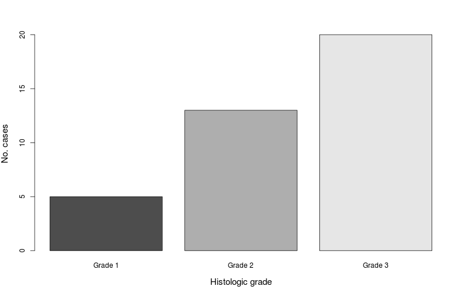
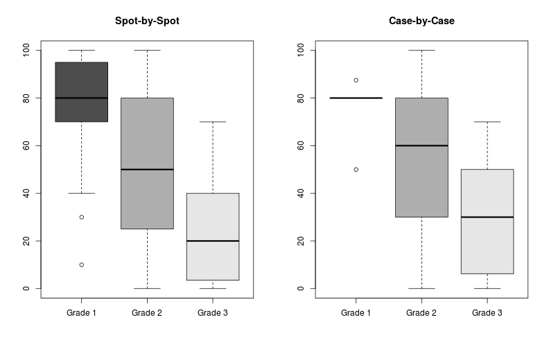
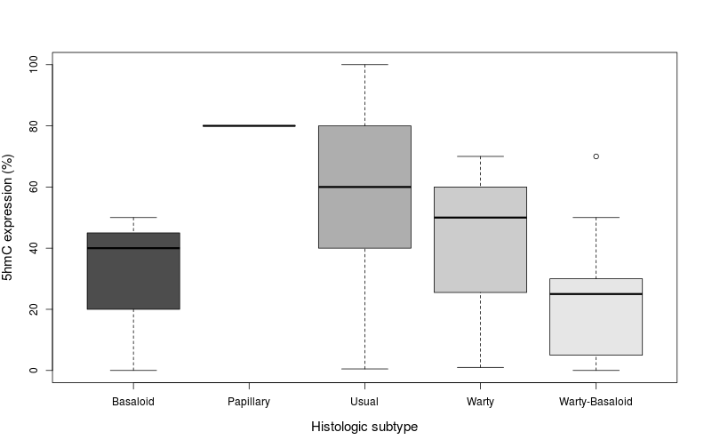

# Data Analysis

## Preparing the environment and dataset for analysis

```r
# Setting the global options for the analysis
library(knitr)
opts_chunk$set(echo = TRUE, message = FALSE, warning = FALSE, fig.height = 5, fig.width = 9)
```


```r
# Loading the requiered libraries and sources
library(plyr)
source("../StandardAnalysis3.R")
source("../Cuzick.R")
```


```r
# Loading the full dataset
DataFull <- read.csv("tma852-855_dataset.csv", na.strings = ".")
# Selecting the variables for the study
Variables <- c("caseid", "subtype", "grade", "X5hmc")
DataSelected <- DataFull[, Variables]
# Subsetting the data to exclude rows with missing cases
DataSpot <- subset(DataSelected, !is.na(X5hmc))
DataSpot <- subset(DataSpot, !is.na(grade))
# Renaming variable of interest
DataSpot <- rename(DataSpot, c("X5hmc" = "fhmc"))
# Renaming levels of the "subtype" variable
DataSpot$subtype <- revalue(DataSpot$subtype, c("basaloid" = "Basaloid",
                "papillary" = "Papillary", "usual" = "Usual", "warty" = "Warty",
                "warty-basaloid" = "Warty-Basaloid"))
# Converting numeric variable "grade" to factor variable and renaming levels
DataSpot$grade <- factor(DataSpot$grade)
DataSpot$grade <- revalue(DataSpot$grade, c("1" = "Grade 1", "2" = "Grade 2", "3" = "Grade 3"))
# Creating a "case-by-case" dataset
DataCase <- ddply(DataSpot, c("caseid", "subtype"), summarize,
                  gradeCase = max(as.numeric(grade)), fhmcCase = median(fhmc))
# Converting numeric variable "gradeCase" to factor variable and renaming levels
DataCase$gradeCase <- factor(DataCase$gradeCase)
DataCase$gradeCase <- revalue(DataCase$gradeCase, c("1" = "Grade 1", "2" = "Grade 2", "3" = "Grade 3"))
# Dropping unused levels
DataSpot <- droplevels(DataSpot)
DataCase <- droplevels(DataCase)
```

## Results
A total of 147 TMA spots were analyzed, corresponding to 38 cases of penile squamous cell carcinoma. The distribution by histologic subtype and grade (for all cases) is shown below.

* __Distribution by histologic subype__

```r
with(DataCase, barplot(table(subtype), xlab = "Histologic subtype", ylab = "No. cases",
                       cex.lab = 1.25, col = gray.colors(5)))
```

 

```r
table.prop(DataCase$subtype)
```

```
##                Count Percentages
## Basaloid           3         7.9
## Papillary          1         2.6
## Usual             21        55.3
## Warty              3         7.9
## Warty-Basaloid    10        26.3
```

* __Distribution by histologic grade__

```r
with(DataCase, barplot(table(gradeCase), xlab = "Histologic grade", ylab = "No. cases",
                       cex.lab = 1.25, col = gray.colors(3)))
```

 

```r
table.prop(DataCase$gradeCase)
```

```
##         Count Percentages
## Grade 1     5        13.2
## Grade 2    13        34.2
## Grade 3    20        52.6
```

***

### Association of 5mhC with histologic grade
* __Boxplots of 5hmC expression__

```r
par(mfrow = c(1, 2))
# Spot-by-spot boxplot
with(DataSpot, boxplot(fhmc ~ grade, main = "Spot-by-Spot", col = gray.colors(3)))
# Case-by-case boxplot
with(DataCase, boxplot(fhmcCase ~ gradeCase, main = "Case-by-Case", col = gray.colors(3)))
```

 

* __Kruskal-Wallis test__

```r
# Spot-by-spot KW test
kruskal.test(fhmc ~ grade, data = DataSpot)
```

```
## 
## 	Kruskal-Wallis rank sum test
## 
## data:  fhmc by grade
## Kruskal-Wallis chi-squared = 43.72, df = 2, p-value = 3.214e-10
```

```r
# Case-by-Case KW test
kruskal.test(fhmcCase ~ gradeCase, data = DataCase)
```

```
## 
## 	Kruskal-Wallis rank sum test
## 
## data:  fhmcCase by gradeCase
## Kruskal-Wallis chi-squared = 10.97, df = 2, p-value = 0.004153
```

* __Cuzick test__

```r
# Spot-by-spot Cuzick test
cuzick(DataSpot$grade, DataSpot$fhmc)
```

```
##   Z-Score   P value
## 1  -9.705 2.867e-22
```

```r
# Case-by-Case Cuzick test
cuzick(DataCase$gradeCase, DataCase$fhmcCase)
```

```
##   Z-Score P value
## 1   1.634  0.1022
```

* __Immunohistochemical 5hmC expression__


***

### Association of 5hmC with histologic subtype

```r
with(DataCase, boxplot(fhmcCase ~ subtype, cex.lab = 1.25, col = gray.colors(5),
                       xlab = "Histologic subtype", ylab = "5hmC expression (%)"))
```

 

* __Kruskal-Wallis test__

```r
# 5hmC by histologic subtype in all cases
kruskal.test(fhmcCase ~ subtype, data = DataCase)
```

```
## 
## 	Kruskal-Wallis rank sum test
## 
## data:  fhmcCase by subtype
## Kruskal-Wallis chi-squared = 9.799, df = 4, p-value = 0.04395
```

***

### Histologic grade by histologic subtype
* __Barplot of histologic grade by subtype__

```r
# Histologic subtype by grade in all cases
with(DataCase, barplot(table(gradeCase, subtype), beside = TRUE, cex.lab = 1.25,
                       xlab = "Histologic subtype", ylab = "No. Cases",
                       legend.text = TRUE, args.legend = list(x = 4)))
```

 

* __Fisher's exact test for histologic grade by subtype__

```r
with(DataCase, fisher.test(gradeCase, subtype))
```

```
## 
## 	Fisher's Exact Test for Count Data
## 
## data:  gradeCase and subtype
## p-value = 0.00794
## alternative hypothesis: two.sided
```

***

### 5hmC expression in usual SCC
* __Boxplot of 5hmC in usual SCC__

```r
with(DataCase[DataCase$subtype == "Usual",],
     boxplot(fhmcCase ~ gradeCase, main = "Usual SCC", col = gray.colors(3),
             ylab = "5hmC Expression (%)", cex.lab = 1.25))
```

 

* __Kruskal-Wallis test__

```r
with(DataCase[DataCase$subtype == "Usual",], kruskal.test(fhmcCase ~ gradeCase))
```

```
## 
## 	Kruskal-Wallis rank sum test
## 
## data:  fhmcCase by gradeCase
## Kruskal-Wallis chi-squared = 4.931, df = 2, p-value = 0.08498
```

* __Cuzick test__

```r
with(DataCase[DataCase$subtype == "Usual",], cuzick(gradeCase, fhmcCase))
```

```
##   Z-Score P value
## 1  0.7391  0.4599
```

***
